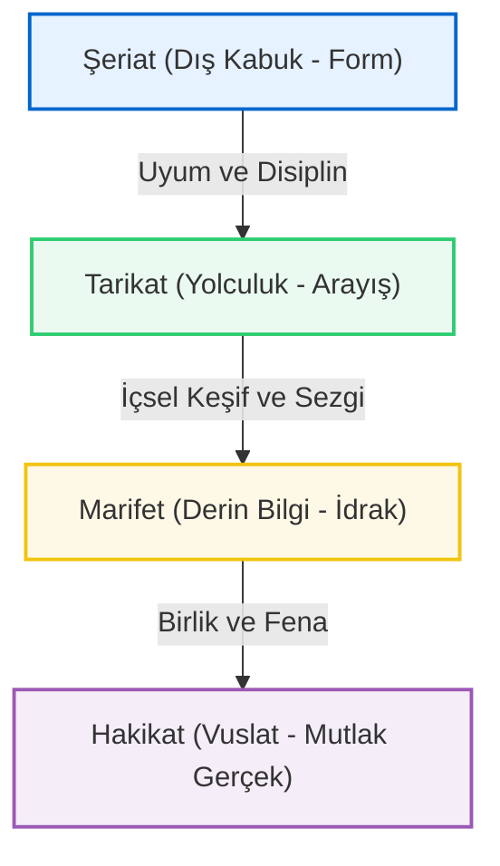

# Makalat-ı Şems: Hakikat Arayışının Koordinatları

Şems-i Tebrizi'nin "Makalat"ı, Mevlana ile olan o gizemli buluşmanın felsefi ve mistik altyapısını oluşturur. Bu metinler, sadece dini öğütler değil, aynı zamanda insanın kendi iç dünyasındaki "yabancılaşmaya" karşı bir başkaldırıdır.

## Şems'in Ontolojik Devrimi
Şems, kâğıt üzerindeki bilginin (kâl ilmi) insanın ayağına dolanan bir bağ olduğunu savunur. Ona göre asıl bilgi, "hâl ilmi"dir yani yaşanarak elde edilen hakikattir.

### Makalat'tan Seçme Hikmetler
- *"İlim, insanın kendisini bilmesidir. Kendini bilmeyen, bin yıl okusa da cahildir."*
- *"Sözün azı makbuldür; zira hakikat, sessizlikte demlenir."*
- *"Bir mürşit arıyorsan, önce kendi içindeki karanlığı aydınlatacak bir mum yak."*

## Tebrizli Şems'in "Kimya"sı
Şems, Mevlana'yı "Kimya Hatun" üzerinden değil, "Kimyagerlik" üzerinden dönüştürmüştür. Bakırı (ham nefsi) altına (insan-ı kâmile) dönüştürme süreci, Tebriz'in o sert ve disiplinli dervişlik okulunun bir sonucudur.

---

### İşraki Felsefe ile Bağlantı
Şems-i Tebrizi'nin düşünceleri, Şahabettin Sühreverdi'nin (Maktul) "İşrakilik" (Işık Felsefesi) ekolüyle derin paralellikler taşır. Tebriz, bu ışık felsefesinin coğrafi ve manevi merkezidir.

## Şems'in Seyr ü Sülûk Tasavvuru: Dört Kapı

Şems-i Tebrizi'nin "Makalat"ında bahsettiği manevi yükseliş ve kemalat yolculuğu, tasavvufun kadim "Dört Kapı Kırk Makam" öğretisiyle şekillenir. İnsanın hamlıktan olgunluğa geçiş süreci şu evrelerle şematize edilebilir:

- **Şeriat Kapısı:** Kurallar, formlar ve dışsal ibadetler. Hakikatin en dıştaki koruyucu kabuğudur.
- **Tarikat Kapısı:** Bir rehber eşliğinde içsel yolculuğa çıkış. Kabuğu kırıp öze doğru yürümektir.
- **Marifet Kapısı:** Aklın ötesinde, kalbi bir sezgiyle ilahi sırları idrak etme hali.
- **Hakikat Kapısı:** Benliğin (nefsin) tamamen ortadan kalktığı ve mutlak varlıkta yok olunduğu (fena fillah) zirve noktası.

Şems'e göre, Şeriat kapısında takılıp kalanlar "kağıt üstündeki dervişler"dir. Asıl amaç, bu kapılardan geçerek Hakikat'in turkuaz ışığına ulaşmaktır.

---

## Mülakat-ı Şeyheyn: Şems ve Mevlana Buluşması
1244 yılında Konya'da gerçekleşen tarihi buluşma, sadece iki mutasavvıfın bir araya gelmesi değil, İslam düşünce tarihinde aklın ve aşkın en büyük çarpışmasıdır. Şems, Mevlana'nın kitaplarını suya atarak ona kağıtların ötesindeki hakikati göstermiştir. Bu "Mülakat", Mevlana'yı bir fıkıh aliminden cihanşümul bir aşk şairine dönüştürmüştür.

## Şems'in Ebedi İstirahatgâhı: Hoy Şems-i Tebrizi Türbesi
Şems'in Konya'dan ani ayrılışından sonra nerede sır olduğu uzun süre tartışılmıştır. Ancak tarihi vesikalar ve Tebriz kültür hafızası, onun Tebriz yakınlarındaki **Hoy** şehrine döndüğünü ve orada vefat ettiğini doğrular. Bugün Hoy'da bulunan *Şems-i Tebrizi Minaresi*, onun ebedi sessizliğinin ve bu coğrafyadaki sarsılmaz izinin en büyük kanıtıdır.

> [!TIP]
> Makalat metinlerini okurken, kelimelerin literal anlamlarından ziyade, onların işaret ettiği "batıni" derinliklere odaklanmak gerekir. Şems, konuşan bir derviş değil, muhatabını sarsarak uyandıran manevi bir fırtınadır.
