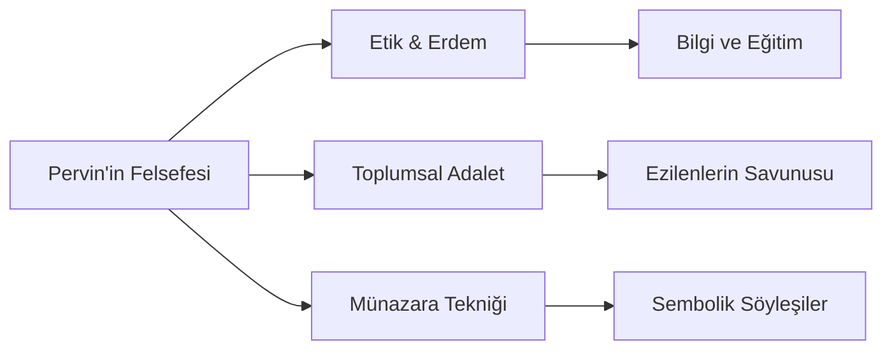

# Pervin E'tesami: Sessizlerin Sesi ve Edebi Münazara Ustası

Tebriz kökenli **Pervin E'tesami** (1907 - 1941), modern İran ve Azerbaycan edebiyatının en önemli kadın şairlerinden biridir. Onun şiirleri, bireysel çığlıkların ötesinde, toplumsal adaletsizliklere, yoksulluğa ve ahlaki yozlaşmaya karşı yükselen vakur ve felsefi bir feryattır.

## Hayatı ve Entelektüel Kökenleri

Pervin E'tesami, Tebrizli aydın bir ailede dünyaya gelmiştir. Babası **Yusuf E'tesami (E'tesamü'l-Mülk)**, döneminin önemli bir yazar, çevirmen ve yayıncısıdır. Pervin, babasının zengin kütüphanesi ve evlerinde düzenlenen edebi meclisler sayesinde küçük yaşlardan itibaren klasik şiir, felsefe ve sosyal bilimlerle iç içe büyümüştür. Dönemin büyük edipleri (Dehhuda, Bahar vb.) onun dehasını daha çocuk yaşta fark etmişlerdir.

---

## Şiir Tarzı: Münazara (Karşılıklı Söyleşme) Sanatı

Pervin'in edebi dehasının en belirgin göstergesi, klasik **münazara** tekniğini toplumsal ve etik bir eleştiri aracı olarak mükemmel bir şekilde kullanmasıdır. Şiirlerinde iki cansız nesne, hayvan veya sembolik karakter karşı karşıya gelerek felsefi bir tartışmaya tutuşur. Bu yöntemle şair, doğrudan söyleyemediği siyasi ve sosyal eleştirileri lirik ve sarsıcı bir dille ifade eder.

### Temel Münazara Temaları
- **Sarımsak ve Soğan:** Kendi kusurlarını görmeyip başkalarını ayıplayan insan tipinin eleştirisi.
- **Kralın Tacındaki Elmas ve Yetim Çocuğun Gözyaşı:** Sarayların ihtişamının arkasında yatan halk sömürüsünün ifşası.
- **Nohut ve Tencere:** Hayatın zorluklarına ve imtihanlarına sabretmenin felsefi boyutu.

> *"Kralın tacındaki o göz alıcı elmas nedir bilir misin? / O, yetim çocuğun geceleri döktüğü gözyaşının donmuş halidir."* — **Pervin E'tesami**

---

## Toplumsal Adalet ve Etik Çizgisi

Pervin E'tesami, şiirlerinde sadece edebi bir estetik aramakla kalmamış, edebiyatı sivil bir ahlak okulu haline getirmiştir. Onun şiirlerindeki ana temalar şunlardır:

1. **Yoksulların ve Yetimlerin Savunusu:** Toplumsal eşitsizliğin pençesinde kıvranan alt sınıfların sessiz çığlığını saraya ve zenginlere duyurma çabası.
2. **Kadın Eğitimi ve Hakları:** Kadının toplumdaki yerinin ancak eğitim ve özgür düşünceyle yükselebileceğine dair sarsılmaz inancı.
3. **Zamanın Geçiciliği ve Bilgelik:** Hayatın fani oluşuna karşı insanın erdem ve bilgiyle kalıcı eserler bırakması gerektiği fikri.

## Edebi Mirası

Genç yaşta (34 yaşında) tifo nedeniyle vefat eden Pervin E'tesami, geride kısa ama etkisi asırlar boyu sürecek devasa bir Divan bırakmıştır. Onun mezarı Kum kentindeki Hazret-i Masume Türbesi yakınında bulunsa da, edebi ruhu ve hürriyetçi çizgisi Tebriz'in ve Doğu'nun özgürlük sembolü olarak yaşamaya devam etmektedir.

> [!NOTE]
> Pervin'in şiiri, didaktik olduğu kadar son derece duygusal ve estetiktir. Şiirlerinde hiçbir zaman ucuz bir ajitasyona kaçmamış, eleştirilerini her zaman evrensel insani değerler ve sarsılmaz bir mantık çerçevesinde sunmuştur.
