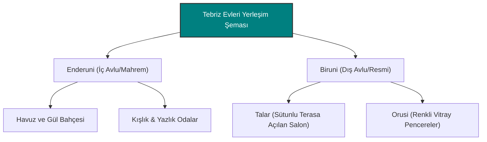

# Tebriz Tarihi Evleri: Sivil Mimarinin Estetik Hafızası

Tebriz, sadece anıtsal camileri ve kaleleriyle değil, Safevi, Kaçar ve Meşrutiyet dönemlerinden miras kalan muhteşem **tarihi evleri (konakları)** ile de ünlüdür. Bu evler, şehrin zorlu iklim koşullarına (sert kışlar, sıcak yazlar) uyum sağlayan ve Doğu'nun mahremiyet ile estetiği birleştiren sivil mimari dehasını yansıtır.

---

## Geleneksel Ev Mimarisi Yapı Taşları

Tebriz konaklarındaki mimari yerleşim, belirli bir mahremiyet ve iklimsel fonksiyon hiyerarşisine dayanır:

- **Biruni (Dış Avlu):** Misafirlerin kabul edildiği, resmi görüşmelerin yapıldığı ve dış dünyaya açık olan bölümdür. Genellikle daha resmi ve gösterişli tezyinata sahiptir.
- **Enderuni (İç Avlu):** Aile fertlerinin günlük yaşamını sürdürdüğü, dışarıdan görünmeyen mahrem alandır. Bahçe ve havuz (havuzlu avlu) genellikle buradadır.
- **Orusi (Tılsımlı Pencereler):** Yukarıya doğru kayarak açılan, geometrik ahşap kafesler ve rengarenk vitray camlarla süslenmiş pencerelerdir. Gün ışığını içeriye alırken içeriyi dışarıdan gizler ve haşereleri uzak tutma özelliğiyle bilinir.
- **Talar (Sütunlu Eyvan):** Genellikle güneye bakan, devasa sütunlarla desteklenen ve yaz aylarında serin bir gölgelik alan sunan yarı açık ön cephe terasıdır.

---

## En Önemli Tebriz Konakları

### 1. Behnam Evi (Safevi/Kaçar Dönemi)
Bugün Tebriz Sanat Üniversitesi'nin bir parçası olan Behnam Evi, mimari zarafetin doruk noktasıdır:
- **Yapısı:** Bir ana kışlık bina ve bir yazlık binadan oluşur. Duvarlarındaki el yapımı freskler ve tavan süslemeleri adeta bir müze niteliğindedir.
- **Önemi:** Şehrin en eski sivil yapılarından biri olup Safevi mimari dengesiyle Kaçar estetiğinin kesişimini gösterir.

### 2. Meşrutiyet Evi (Constitution House / Hane-i Meşrute)
Tebriz'in sadece mimari değil, aynı zamanda siyasi tarihi için de en kutsal yapılarından biridir:
- **Tarihi Rolü:** 1905-1911 Meşrutiyet Devrimi sırasında Sattar Han, Bağır Han ve diğer mücahitlerin karargâhı olarak kullanılmıştır. Devrim kararları bu binada alınmıştır.
- **Mimari Detay:** İki katlı yapısı, muhteşem vitray (orusi) pencereleri ve avlusundaki havuzuyla klasik Kaçar mimarisinin en dinamik örneğidir.

### 3. Hariri Evi (Kaçar Dönemi)
Sanatın ve görsel zenginliğin doruğa çıktığı konaktır:
- **Freskler:** Duvarları, Yusuf ile Züleyha gibi Kur'an kıssalarını ve klasik edebiyat sahnelerini tasvir eden harika duvar resimleriyle kaplıdır.
- **Renk Paleti:** Tebriz minyatür okulunun renk uyumunu duvarlara yansıtan en parlak mimari yapıdır.

### 4. Emir Nezam Evi (Kaçar Müzesi)
Safevi döneminden kalma bir temel üzerine Kaçar döneminde inşa edilen saray yavrusu bir konaktır:
- **Tasarımı:** Devasa sütunlu terası (Talar), iki büyük avlusu ve alt katındaki sarnıçlı havuzu (Havuzhane) ile serinliği içeride hapseden bir mühendislik harikasıdır.
- **İçerik:** Günümüzde Kaçar dönemine ait sikkelerin, çinilerin, müzik aletlerinin ve silahların sergilendiği bir müze olarak hizmet vermektedir.

---

> [!TIP]
> Tebriz tarihi evlerini gezerken pencerelerden süzülen renkli ışıkların zemin üzerindeki dansını izlemek gerekir. Bu mimari, güneşin hareketlerini ve ışığı bir tezyinat unsuru olarak kullanan derin bir estetik bilincin ürünüdür.
