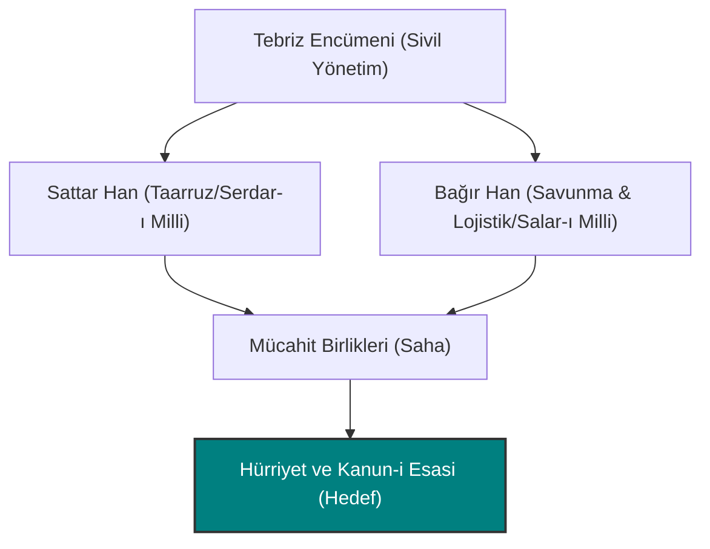

# Bağır Han: Salar-ı Milli ve Tebriz Direnişinin Stratejik Aklı

**Bağır Han** (1861 - 1916), İran Meşrutiyet Devrimi'nin ve Tebriz sivil direnişinin en büyük iki önderinden biridir. Direnişteki olağanüstü askeri ve idari başarıları nedeniyle meclis tarafından kendisine **"Salar-ı Milli" (Milli Komutan)** unvanı verilmiştir. Sattar Han ile kurduğu ortaklık, Doğu'nun özgürlük mücadelesindeki en etkili siyasi ve askeri ittifaklardan biridir.

---

## İlk Yılları ve Tebriz Sokakları

Tebriz'in Surhab mahallesinde doğan Bağır Han, gençlik yıllarında belediye bünyesinde vergi memurluğu ve yapı işleriyle uğraşmıştır. Şehrin sokak yapısını, mahallelerini ve insan karakterini çok iyi analiz eden bu deneyimi, gelecekteki sokak savaşı (gerilla) savunmalarında ona büyük bir avantaj sağlayacaktır.

---

## 1908 Tebriz Kuşatması ve Askeri Dehası

Tahran'da şah kuvvetlerinin anayasayı askıya alıp meclisi bombalamasından sonra Tebriz, istibdada karşı tek başına direnme kararı almıştır. Şahın devasa ordusu şehri kuşattığında direniş şu şekilde organize edilmiştir:

1. **Mahalle Savunma Hatları:** Bağır Han, kendi doğduğu Surhab mahallesinin mücahitler ordusunun komutasını üstlenmiştir. Şehrin her bir sokağını barikatlarla örerek şahın süvarilerini etkisiz hale getirmiştir.
2. **Lojistik ve Eşgüdüm:** Sattar Han cephede askeri taarruzları yönetirken, Bağır Han direnişin geri planındaki lojistik organizasyonu, yiyecek dağıtımını ve mahalleler arası istihbarat akışını koordine etmiştir.
3. **Kuşatmanın Yarılması:** 11 ay süren ve halkın açlıkla mücadele ettiği kuşatma boyunca Bağır Han'ın kararlılığı ve stratejik savunması, şahın ordusunu yıpratarak geri çekilmeye zorlamıştır.

---

## Sattar Han ile Siyasi ve Askeri Ortaklık

Sattar Han ve Bağır Han, Tebriz halkının gözünde birbirini tamamlayan iki yarım gibidir:

| Nitelik | Sattar Han (Serdar-ı Milli) | Bağır Han (Salar-ı Milli) |
| :--- | :--- | :--- |
| **Rolü** | Karizmatik saha lideri, hücum komutanı. | Stratejik organizatör, savunma aklı. |
| **Üslubu** | Coşkulu, askerleri ve halkı doğrudan ateşleyen lirik güç. | Sakin, planlı, idari dengeleri gözeten analitik güç. |
| **Miras** | Direnişin askeri sembolü. | Direnişin sivil ve mahalle teşkilatlanmasının mimarı. |

---

## Ebedi Mirası

Tebriz direnişinin başarısından sonra Tahran'a yürüyen kuvvetler arasında yer alan Bağır Han, daha sonraki siyasi karmaşalarda ve Birinci Dünya Savaşı sırasında vatansever güçleri organize etmek için çabalamıştır. 1916 yılında Batı İran sınırında kalleşçe bir suikast sonucu şehit edilmiştir.

Bağır Han'ın anısı, bugün Tebriz'in hürriyet mücadelesinde planlı ve örgütlü direnişin en büyük simgesi olarak anılmaktadır. O, halkın içinden çıkıp sarsılmaz bir inançla koca bir imparatorluğa meydan okuyan bir "halk generali"dir.

> [!IMPORTANT]
> Bağır Han'ın başarısı, Tebriz halkının yerel örgütlenme gücünü göstermesi açısından kritiktir. O, sadece askeri güçle değil, esnaf encümenleri ve mahalle dayanışma ağları kurarak direnişi sürdürülebilir kılmıştır.
