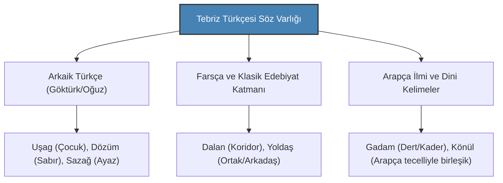

# Tebriz Türkçesinin Fonetik Yapısı ve Etimolojik Katmanları

Tebriz Türkçesi (Azerbaycan Türkçesinin Tebriz ağzı), Türk dil ailesinin Oğuz grubuna ait olup, arkaik ses özelliklerini koruyan ve Farsça ile asırlar boyu süren kültürel temas neticesinde kendine has morfolojik ve sentaks (sözdizimi) nitelikleri geliştirmiş zengin bir dil sistemidir.

---

## 1. Fonetik (Ses Bilgisi) Özellikleri

Tebriz ağzını standart Türkçeden ve diğer Azerbaycan diyalektlerinden ayıran temel ses kuralları şunlardır:

### A. Kalın/İnce Ünlü Dengesi ve Korunan Sesler
- **"e" / "ə" (Açık e) Ayrımı:** Eski Türkçe ve Göktürkçede bulunan kapalı/açık e sesleri Tebriz ağzında korunmuştur (Örn: *Mən* - Ben, *Gəlmək* - Gelmek).
- **"ı" / "i" Nöbetleşmesi:** Kelime içindeki bazı "i" sesleri kalınlaşarak "ı" sesine dönüşebilir (Örn: *Yışık* / *Işık* yerine *Işıg*, *Kimin* yerine *Kım* veya *Kimin*).

### B. Konsonant (Ünsüz) Değişimleri
- **k -> g / g -> y Değişimi:** Kelime başındaki sert "k" sesleri yumuşayarak tınlayan bir "g" sesine dönüşür (Örn: *Kitap* -> *Gitab*, *Köprü* -> *Görpi*).
- **b -> m Değişimi:** Burun ünsüzlerinin etkisiyle kelime başındaki "b" sesleri "m"ye dönüşür (Örn: *Ben* -> *Mən*, *Binmek* -> *Minmək*).
- **t -> d Değişimi:** Kelime başındaki "t" sesleri yumuşayarak "d" olur (Örn: *Taş* -> *Daş*, *Diri* -> *Diri*).

---

## 2. Etimolojik Katmanlar

Tebriz Türkçesi, tarih boyunca farklı dillerle etkileşime girse de çekirdek söz varlığını ve arkaik yapısını korumuştur:

### A. Arkaik Türkçe (Oğuz Mirası)
Tebriz Türkçesinde, Türkiye Türkçesinde unutulmuş veya halk ağızlarında kalmış pek çok antik Türkçe kelime standart olarak kullanılır:
- **Nəçə / Necə:** Nasıl, kaç (Orhun Yazıtlarındaki "neçe" sözünün devamı).
- **Yaxşı:** İyi (Eski Türkçe "yakşı" sözü).
- **Tapşırmak:** Emanet etmek, teslim etmek (Eski Türkçe "tapşurmak").

### B. Farsça Arayüzü (Sentaktik Etki)
Asırlarca yan yana yaşayan bu iki dil, özellikle sözdiziminde birbirini etkilemiştir:
- **"Ki" Bağlacı:** Tebriz Türkçesinde cümleleri birbirine bağlayan "ki" bağlacı, Farsçanın etkisiyle son derece yaygındır ve Türkçe fiil çekimlerini Farsça cümle yapısına yaklaştırır (Örn: *Deyirəm ki gələsen* -> Gelmeni söylüyorum).
- **Kelime Ödünçlemeleri:** Günlük yaşamda ve mimaride kullanılan pek çok Farsça kelime fonetik olarak Türkçeleştirilmiştir (Örn: *Hane* -> *Hana*, *Dalan* -> *Dalan*).

---

## 3. Morfolojik (Şekil Bilgisi) Karakterler

- **Şimdiki Zaman Eki (-iyir):** Tebriz ağzının en karakteristik eki şimdiki zamanı kuran "-iyir" ekidir (Örn: *Gediyirəm* - Gidiyorum, *İstiyirəm* - İstiyorum). Bu ek, "-a/-e" yönelme zarf-fiili ile "yörümek" fiilinin birleşmesinden evrilmiştir.
- **Yönelme Halindeki Ünlü Daralması:** Son harfi ünlü olan kelimelere yönelme eki geldiğinde ünlü daralır (Örn: *Bakı'ya* -> *Bakı'ya*, *Tebriz'e* -> *Tebriz'e* telaffuzda daralır).

---

> [!NOTE]
> Tebriz Türkçesi, bir taraftan Göktürk metinlerinin arkaik fonetik mirasını korurken, diğer taraftan Farsçanın şiirsel sentaksını kendi bünyesinde eriterek eşsiz bir "edebi diyalekt" meydana getirmiştir. Bu dil, Tebriz halkının hafıza kalesidir.
