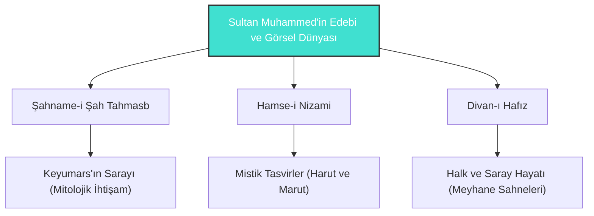

# Sultan Muhammed: Tebriz Minyatür Okulu'nun Dahi Fırçası

**Sultan Muhammed** (16. yüzyıl), Safevi dönemi Tebriz Minyatür Okulu'nun en büyük üstadı, saray nakkaşhanesinin baş ressamı ve Doğu resim sanatının gelmiş geçmiş en dahi fırçalarından biridir. O, klasik minyatür kalıplarını kırarak tasvirlerine inanılmaz bir dinamizm, yoğun detay zenginliği ve mistik bir derinlik kazandırmıştır.

---

## Sanat Üslubunun Özellikleri

Sultan Muhammed'i çağdaşlarından ayıran ve onu dünya sanat tarihine geçiren temel üslup özellikleri şunlardır:

1. **Doğa ve Figür Bütünleşmesi:** Doğa tasvirleri sıradan bir arka plan değil, hikayenin ve duyguların yaşayan ortaklarıdır. Kayalar insan ve hayvan yüzlerini andıran antropomorfik şekillerde çizilmiştir.
2. **Kozmik Renk Paleti:** Altın sarısı, turkuaz, lapis lazuli mavisi ve yakut kırmızısını muazzam bir dengeyle kullanarak sahnelerine büyülü ve metafizik bir atmosfer kazandırmıştır.
3. **Mizahi ve Günlük Detaylar:** Saray sahnelerinin veya mitolojik anlatıların arasına halktan insanların, oduncuların, uyuyan dervişlerin veya muzip hayvanların gerçekçi tasvirlerini sıkıştırarak resme hayat vermiştir.
4. **Figürlerdeki Dinamik Hareket:** Durağan klasik minyatür anlayışının aksine, figürleri havada uçuşan kıyafetlerle, koşarken ve jest mimiklerle tasvir etmiştir.

---

## Başyapıtları

### 1. Keyumars'ın Sarayı (The Court of the Gayumars)
*Şahname-i Şah Tahmasb* (veya *Houghton Şahnamesi*) içinde yer alan bu minyatür, Doğu resim sanatının zirvesi kabul edilir:
- **Konu:** İran mitolojisindeki ilk kral olan Keyumars'ın, dağdaki sarayında vahşi hayvanları ve tebaasını etrafında toplayarak onlara medeniyeti öğretmesi.
- **Detay Seviyesi:** Resimde yüzlerce insan ve hayvan figürü, çiçekler ve mistik kayalar iç içe geçmiş durumdadır. Tek bir yaprağın çizimi için günlerce uğraşıldığı bilinir.
- **Batı Sanatındaki Karşılığı:** Dönemin ünlü batılı sanat tarihçileri, bu resmi Leonardo da Vinci veya Michelangelo'nun şaheserleriyle eş değer tutmuştur.

### 2. Harut ile Marut (Hamse-i Nizami)
Babil'de insanları büyüyle imtihan eden iki meleğin hikayesini anlatan bu minyatürde, Sultan Muhammed'in gökyüzü tasvirleri ve meleklerin kanatlarındaki detay zenginliği, Safevi estetiğinin ulaştığı teknik ve felsefi olgunluğu belgeler.

---

## Edebi ve Sanatsal Mirası

Sultan Muhammed, Şah Tahmasb'ın bizzat resim dersi aldığı ve himaye ettiği bir sanatçıdır. Tebriz nakkaşhanesinde yetiştirdiği öğrenciler (Mir Musavvir, Ağa Mirek vb.) Safevi sanatının sonraki nesillerini şekillendirmiştir. Onun fırçası, taşların ve renklerin sessiz zikridir.

> [!IMPORTANT]
> Sultan Muhammed'in minyatürleri, sadece edebi eserleri süsleyen görseller değildir; her bir sayfa, Şems'in felsefesiyle paralel olarak görünen dünyanın arkasındaki "batıni" (içsel) gerçekliği ve ilahi düzeni yansıtan kozmik birer haritadır.
