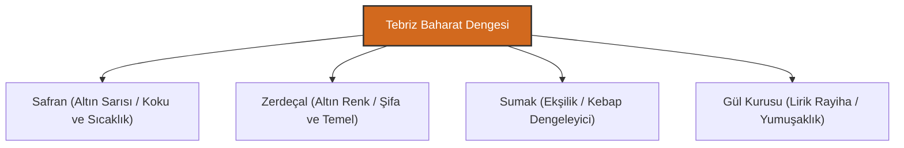

# Tebriz Şerbetleri ve Baharat Kültürü: Lezzetin Simyası

Tebriz gastronomi geleneğinde içecekler ve baharatlar, sadece yemeğe eşlik eden yardımcı unsurlar değil; bedensel dengeyi (sıcaklık/soğukluk mizacını) koruyan, şifa sunan ve sofranın estetik zenginliğini tamamlayan temel yapı taşlarıdır.

---

## 1. Geleneksel Tebriz Şerbetleri

Tebriz'in kavurucu yaz aylarında serinlemek ve sindirimi kolaylaştırmak amacıyla asırlardır evlerde hazırlanan en meşhur şerbetler şunlardır:

### A. Tokhum-i Reyhan (Reyhan Tohumu Şerbeti)
- **Yapısı:** Reyhan tohumları (fesleğen tohumu), gül suyu, safran ve hafif şeker ile demlenir. Tohumlar sıvı ile temas ettiğinde etrafında şeffaf, jelimsi bir katman oluşturur.
- **Özelliği:** Vücut ısısını düşüren ve mideyi rahatlatan harika bir ferahlatıcıdır. Görsel olarak da bardakta süzülen tohumlar estetik bir şölen sunar.

### B. Sekencebin (Sirkencebin)
- **Yapısı:** Bal (veya şeker), sirke ve taze nane yapraklarının kaynatılarak süzülmesiyle elde edilen kadim bir şerbettir.
- **Mizacı:** Ekşi ve tatlının muazzam dengesini sunar. Geleneksel olarak marul yaprakları bu şerbete batırılarak yenir (Tebriz'de meşhur bir ikindi vaktidir).

### C. Gül Şerbeti ve Kaşni Suyu
- Tebriz'e yakın **Karadağ** ve **Hoy** bölgelerinden derlenen güllerin damıtılmasıyla elde edilen saf gül suyu (Gülâb) şerbetlerin ana maddesidir. Ayrıca hindiba bitkisinden elde edilen *Kaşni Suyu*, karaciğer dostu bir şifa içeceği olarak şerbetlere eklenir.

---

## 2. Baharat Ontolojisi: Denge ve Şifa

Tebriz mutfağında baharat kullanımı, Hindistan mutfağı gibi acı ve baskın değil; yemeğin ana malzemesinin (et veya sebze) tadını örtmeden onu destekleyen rafine bir denge üzerine kuruludur.

### A. Safran (Zaferan)
- **Kraliyet Dokunuşu:** Safran, Tebriz mutfağının baş tacıdır. Safranlı pirinç pilavından (Çelo) köftelere, tatlılardan şerbetlere kadar her yerde kullanılır. Safran, yemeğe sadece altın sarısı rengini değil, asil bir rayiha ve "sıcaklık" (ruhsal zindelik) verir.

### B. Zerdeçal (Sarıkök)
- **Temel Taş:** Neredeyse tüm etli yemeklerin, çorbaların ve aşların kavurma aşamasında zerdeçal kullanılır. Yemeğe lezzet tabanı ve şifalı bir altın rengi kazandırır.

### C. Sumak (Sumag)
- **Kebabın Yoldaşı:** Tebriz Bonab kebabının ve diğer et yemeklerinin üzerine dökülen sumak, etin ağırlığını ve yağını dengeleyen, sindirimi kolaylaştıran mayhoş bir şifadır.

### D. Kurutulmuş Gül Yaprakları (Gül Kurusu)
- Özellikle süzme yoğurtların, köftelerin ve bazı helvaların üzerine dökülen ufalanmış pembe gül yaprakları, yemeğe lirik bir koku ve görsel zarafet katar.

---

> [!TIP]
> Bir Tebriz sofrasında yemek yerken, her yemeğin yanındaki baharatın ve ikram edilen şerbetin mevsimsel dengesine dikkat edilmelidir. Kışın vücudu ısıtacak safranlı çaylar, yazın ise harareti alacak Sekencebin şerbetleri başroldedir.
