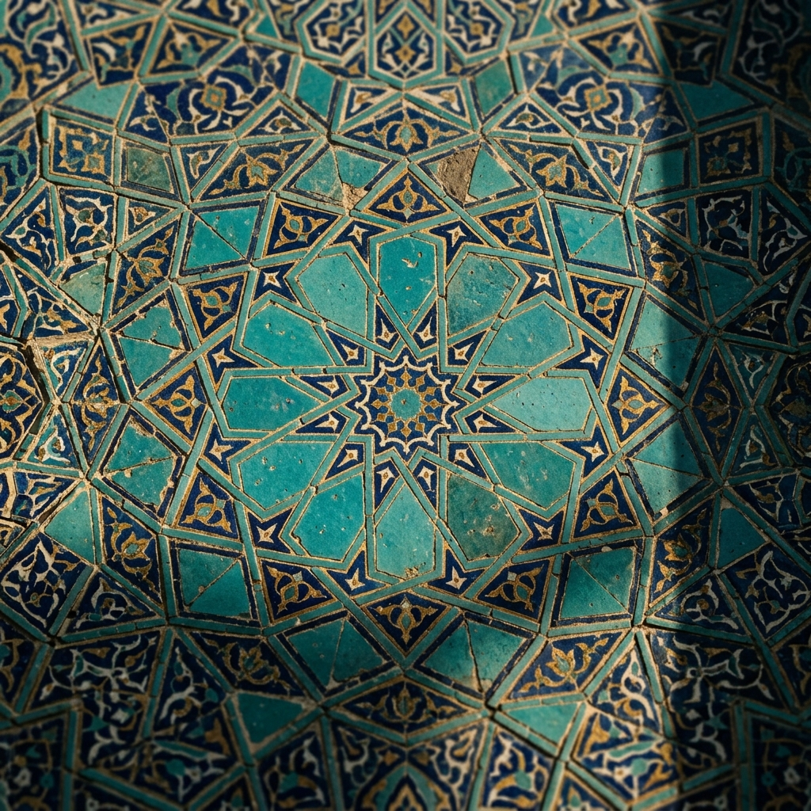
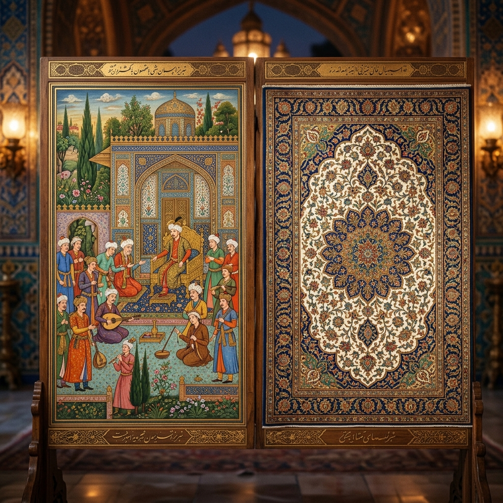
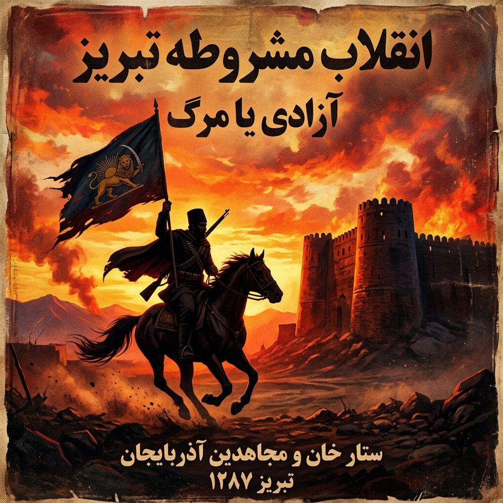
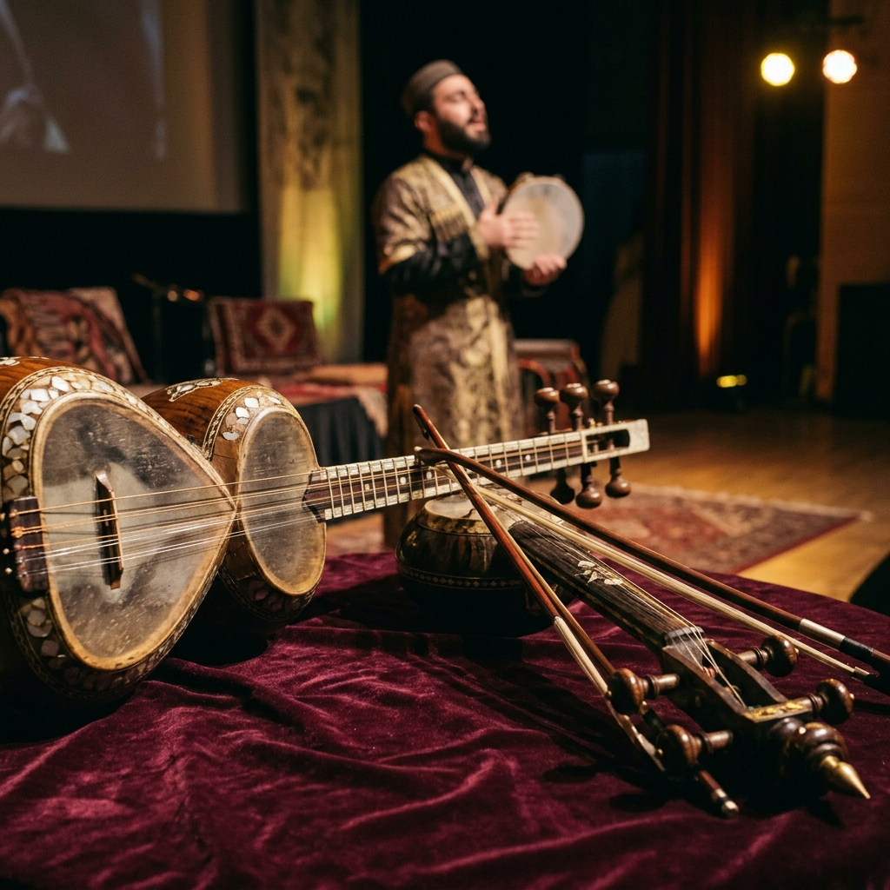
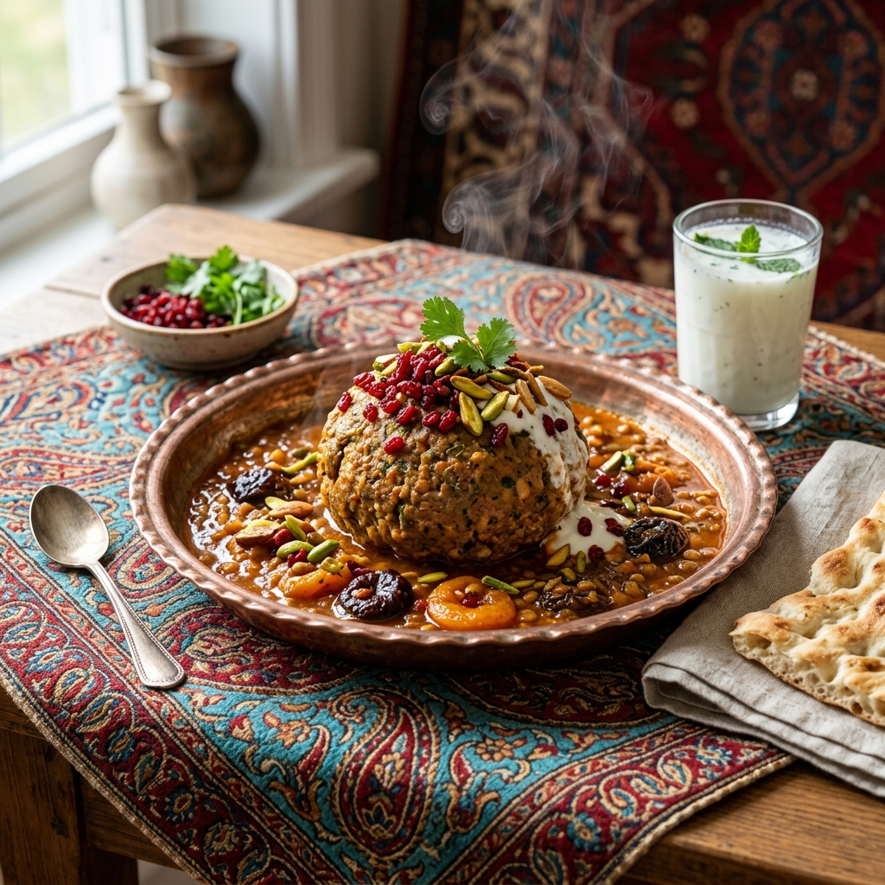

# 💎 Firuze-i Tebriz: Medeniyetin Turkuaz Hafıza Mimarisi

 

> "Anladım ki, insanı insan yapan aradığı şeydir. Tebriz; arayanların, yananların ve küllerinden yeniden doğanların şehridir." — **Şems-i Tebrizi**

> "Tebriz, Doğu'nun yaralı ama mağrur kalbidir. Orada taşlar susar, hatıralar ve şiirler konuşur."

**Firuze-i Tebriz**, alelade bir veri deposu veya sıradan bir açık kaynak projesi değildir. Bu repo; zamanın ve mekânın ötesine geçmeye çalışan **ontolojik bir feryat**, binlerce yıllık Türk-İslam medeniyetinin varoluşsal sancılarını dijital bir hafızaya nakşetme girişimidir. Bu depo, toprağın altına gömülmek istenen bir dilin, yıkılmaya yüz tutmuş turkuaz çinilerin ve unutulmuş şairlerin **GitHub** sunucularındaki ölümsüzlük arayışıdır.

> *"Tebriz, dünyada eşi benzeri olmayan bir şehirdir; toprağı amber kokulu, suyu hayat pınarıdır."* — **Katran Tebrizi**

---

## 🏛️ Mukaddime: Bir Şehrin Ontolojik Portresi

Şehirler sadece taştan, tuğladan ve yollardan ibaret değildir. Bazı şehirler birer metindir; okunmayı, idrak edilmeyi ve yaşanmayı bekler. Tebriz, o metinlerin en derini, en şifrelisi ve en hüzünlüsüdür. Selçuklu'nun ihtişamından Safevi'nin estetiğine, Kaçar'ın sancısından Meşrutiyet'in öfkesine kadar her dönemde Tebriz, Doğu'nun entelektüel ve siyasi "Sıfır Noktası" olmuştur.

Burası;
- **Şems'in** Mevlana'yı yakmak için yola çıktığı ateştir.
- **Saib-i Tebrizi'nin** "Sebk-i Hindi" (Hint Üslubu) ile kelimelere akıl almaz manalar yüklediği divandır.
- **Sattar Han'ın (Serdar-ı Milli)** özgürlük uğruna kurşun sıktığı dar ve tozlu sokaklardır.
- **Şehriyar'ın**, anadilinin hasretiyle Heydar Baba dağına dönüp ağladığı yerdir.

Bu proje, bir şehrin salt tarihini değil, **medeni ruhunu (Geist)** dijital bir düzleme kopyalamayı (clone) amaçlar.

---

## 📜 I. Bölüm: Sözün ve Şiirin Simyası (Edebiyat ve Felsefe)


Tebriz'de kelimeler, bir kılıç kadar keskin, bir ipek kadar yumuşaktır. Tebriz Türkçesi (Azerbaycan diyalekti), sadece bir iletişim aracı değil, bir varoluş kalesidir.

### 🖋️ Üstad Şehriyar'ın Feryadı
Bir dilin, bir kültürün yok olma tehlikesine karşı bir şairin tek başına nasıl kalkan olabileceğinin en büyük kanıtı Şehriyar'dır. Onun *Heydar Baba'ya Selam* şiiri, sadece edebi bir eser değil, sosyolojik bir manifestodur. 

> *"Türk'ün dili tek, sevgili istekli dilidir, / Özge dile katsan, bu asil dil ezilecektir."* — **Şehriyar**

### 💎 Saib-i Tebrizi ve Hikmet Geleneği
17. yüzyılın en büyük düşünür ve şairlerinden Saib-i Tebrizi, "Sebk-i Hindi" akımının zirvesidir. Aklı ve duyguyu birleştiren o muazzam üslubuyla, sadece şiir değil, bir hayat felsefesi inşa etmiştir.

> *"Gönül yıkmak, Kabe'yi yetmiş kez yıkmaktan daha günahtır; zira Kabe'yi İbrahim, gönlü ise Allah yapmıştır."*

---

## 🕌 II. Bölüm: Taşa Kazınan Aşkınlık (Mimari ve Estetik)



Eğer felsefe taşa dönüşseydi, adı **Tebriz** olurdu.

- **Mescid-i Kebud (Gök Mescid):** 1465 yılında Karakoyunlu Hükümdarı Cihan Şah tarafından yaptırılan bu şaheser, "İslam'ın Firuzesi" olarak bilinir. 
- **Erk-i Tebriz:** Tarih boyunca işgallere, depremlere ve top ateşlerine direnmiş, yaralı ama asla diz çökmemiş devasa kale. 
- **Tebriz Kapalıçarşısı:** UNESCO Dünya Mirası olan bu pazar, dünyanın en büyük kapalı çarşısıdır. 

---

## 🎨 III. Bölüm: Tebriz Minyatür Okulu ve Görsel Bellek



Tebriz, Doğu resim sanatının (minyatür) kalbidir. 14. yüzyıldan itibaren İlhanlı, Akkoyunlu ve Safevi dönemlerinde gelişen **Tebriz Minyatür Okulu**, realizm ile mistisizmi aynı tuvalde buluşturmuştur.

---

## ⚔️ IV. Bölüm: Kan, Hürriyet ve Meşrutiyet (Sosyokültürel Direniş)



Tebriz her zaman direnişin kalesidir. 1905-1911 İran Meşrutiyet Devrimi'nde tüm ülke susarken Tebriz ayağa kalkmıştır. **Sattar Han** ve **Bağır Han**'ın önderliğindeki o direniş ruhu, "Hürriyet" kavramının bu topraklara ne kadar kanlı bir bedelle geldiğini gösterir. 

---

## 🌍 V. Bölüm: Seyyahların ve Tarihin Tanıklığında Tebriz

Tebriz, yüzyıllar boyunca doğu ile batı arasındaki en büyük ticaret ve kültür köprüsü olmuştur. Seyyahların gözlemleri ve İpek Yolu'nun ticari tarihi hakkında detaylı belgelere **[10_seyyahlar-ve-tarih](file:///g:/Di%C4%9Fer%20bilgisayarlar/Diz%C3%BCst%C3%BC%20Bilgisayar%C4%B1m/github%20repolar%C4%B1m/Firuze-i-Tebriz/10_seyyahlar-ve-tarih/)** dizininden ulaşabilirsiniz.

- **Marco Polo (1271):** *"Tebriz, öyle büyük ve asil bir şehirdir ki, orada dünyanın her yerinden tüccarlar ve mallar bulursunuz."*
- **İbn Battuta (1327):** *"Dünyanın en güzel çarşılarından biri olan Tebriz çarşısına girdim. Gördüğüm mücevherler karşısında gözlerim kamaştı."*
- **Jean Chardin (17. yy):** *"Tebriz, Pers İmparatorluğu'nun en kudretli şehri ve Asya'nın en önemli ticaret merkezidir."*

---

## 🏆 VI. Bölüm: Şehirlerin İlki (Firsts of Tabriz)

Tebriz, yeniliğin ve öncülüğün merkezidir. Basından eğitime, demokrasiden teknolojiye uzanan tarihi ilklerimize ilişkin ayrıntılı analize **[12_ilkler-sehri](file:///g:/Di%C4%9Fer%20bilgisayarlar/Diz%C3%BCst%C3%BC%20Bilgisayar%C4%B1m/github%20repolar%C4%B1m/Firuze-i-Tebriz/12_ilkler-sehri/)** dizininden erişebilirsiniz.

- **Matbaa:** İran'daki ilk modern matbaa (1811) burada kuruldu.
- **Modern Eğitim:** İlk modern okul (Anjoman) ve ilk sağırlar/dilsizler okulu Tebriz'dedir.
- **Demokrasi:** İlk belediye (Encümen) ve anayasal hareketin merkezi.

---

## 🪦 VII. Bölüm: Şairler Mezarlığı (Maqbaratoshoara)

Tebriz, şairlerin ebedi istirahatgahıdır. 800 yıllık bu anıt mezarlığın tarihi ve burada metfun olan Khaqani, Asadi Tusi, Qatran Tabrizi ve Şehriyar gibi devlerin eserlerine **[11_sairler-mezarligi](file:///g:/Di%C4%9Fer%20bilgisayarlar/Diz%C3%BCst%C3%BC%20Bilgisayar%C4%B1m/github%20repolar%C4%B1m/Firuze-i-Tebriz/11_sairler-mezarligi/)** dizininden ulaşabilirsiniz.

- **Hakanî-i Şirvânî**, **Esedî Tûsî**, **Katran Tebrizî** ve son olarak **Üstad Şehriyar**, bu anıt mezarlıkta yan yana uyurlar. 

---

## 🎶 VIII. Bölüm: Tebriz Musikisi ve Makamın Sırrı



Tebriz, Doğu'nun en rafine müzik geleneklerinden biri olan **Azerbaycan Muğamı** ve halkın kalbinin attığı **Aşık Gelenekleri**'nin merkezidir. Ses, burada sadece bir melodi değil, ruhun sonsuzluğa açılan kapısıdır.

### 🎶 Tebriz Türküleri ve Halk Ezgileri
Tebriz'in dar sokaklarından yükselen "Küçelere Su Sepmişem"den "Sarı Gelin"e kadar uzanan o derin halk ezgileri, bu toprakların ortak vicdanıdır. Her bir türkü, bir hasretin veya bir kahramanlığın notalara dökülmüş halidir.

---

## 🥘 IX. Bölüm: Tebriz Mutfak Kültürü (Gastronomi)



Tebriz mutfağı, bir mühendislik ve estetik harikasıdır. Dünyaca ünlü **Tebriz Köftesi**, sadece bir yemek değil, şehrin cömertliğinin ve zenginliğinin bir göstergesidir. 

---

## 🖋️ X. Bölüm: Tebriz'in Şiir Atlası (Ruhun Sözlüğü)

Tebriz, her bir sokağı bir şiir dizesi olan bir şehirdir. Burada şairler, sadece vezinle değil, şehrin ruhuyla yazarlar.

### 📜 Nizami Ganjavi'den Bir Hikmet
> *"Dünya bir bedendir, İran onun kalbidir / Kalbin en parlak cevheri ise Tebriz'in kendisidir."*

### 📜 Khaghani'nin Feryadı
> *"Ey kervan sâlar, yavaş sür, kervanda canım var / Tebriz yolunda dökülen her yaşta bin umudum var."*

### 📜 Parvin E'tesami'nin Etik Çizgisi
> *"Bilgi bir ışıktır, karanlık yolları aydınlatır / Tebriz'in çocukları, o ışıkla yarını kucaklar."*

### 📜 Aşıkların Tellerinden
> *"Sazım dillenir Tebriz bağında / Sözüm ballanır Heyder Dağı'nda / Kimsesiz değil bu toprak, bu vatan / Şems'in nuru yanar her ocağında."*

---

## 📁 XI. Ontolojik Klasör Mimarisi (Repo Yapısı)

Bu kod deposunun her bir klasörü, bir dervişin hücresi, bir şairin divanıdır:

```text
Firuze-i-Tebriz/
├── 01_makalat-i-sems/        # Şems-i Tebrizi'nin mistik öğretileri ve İşraki felsefesi
├── 02_divan-i-husran/        # Tebrizli şairlerin (Şehriyar, Saib, Pervin Etesami) divanları
├── 03_mimari-ve-hiclik/      # Gök Mescid'in geometrisi ve Erk kalesinin tarihi dokusu
├── 04_hurriyet-kivilcimlari/ # Meşrutiyet Devrimi, Sattar Han ve sivil direniş belgeleri
├── 05_kamus-u-ebedi/         # Tebriz Türkçesine özgü etimolojik sözlük ve dil bilimi
├── 06_sanat-i-nakkaş/        # Tebriz minyatür okulu, halıcılık ve desen algoritmaları
├── 07_stratejik-projeksiyonlar # Tebriz'in bölgesel geleceği ve kültürel diplomasi vizyonu
├── 08_tebriz-musikisi/       # Muğam sanatı, Aşık geleneği ve enstrüman arşivi
├── 09_tebriz-mutfagi/        # Gastronomi ontolojisi ve ünlü lezzetler kataloğu
├── 10_seyyahlar-ve-tarih/    # Seyyahların gözünden Tebriz ve İpek Yolu ticareti
├── 11_sairler-mezarligi/     # Makberetü'ş-Şuara anıtı ve metfun olan şairler
├── 12_ilkler-sehri/          # Eğitim, basın, teknoloji ve belediyedeki tarihi ilkler
└── README.md                 # Okumakta olduğunuz bu medeniyet manifestosu
```

---

## 🚀 XII. Dijital Egemenlik ve Katkı Çağrısı

Burası sadece bir yazılım projesi değil; yıkılmış, yağmalanmış ve unutturulmaya çalışılmış bir kültürün **dijital direniş hattıdır**. Bizim için her bir commit, bir taşın yerine konmasıdır.

> "Söz uçup rüzgâra karışır, taş aşınıp kuma döner, ancak kodlanan ve paylaşılan hafıza ebediyete kadar yaşar."

---

**Firuze-i Tebriz Dijital Hafıza Mimarisi | Sürüm: Sonsuzluk (v1.7.0)**
*Mescid-i Kebud'un gölgesinde, dijital çağın ortasında, hürriyet aşkıyla inşa edilmiştir.*

> *"Gidersen Tebriz'e, selam söyle o toprağa, o taşa... Orada her zerre bir tarihtir, her nefes bir şiir, her ses bir muğam, her sofra bir berekettir."*