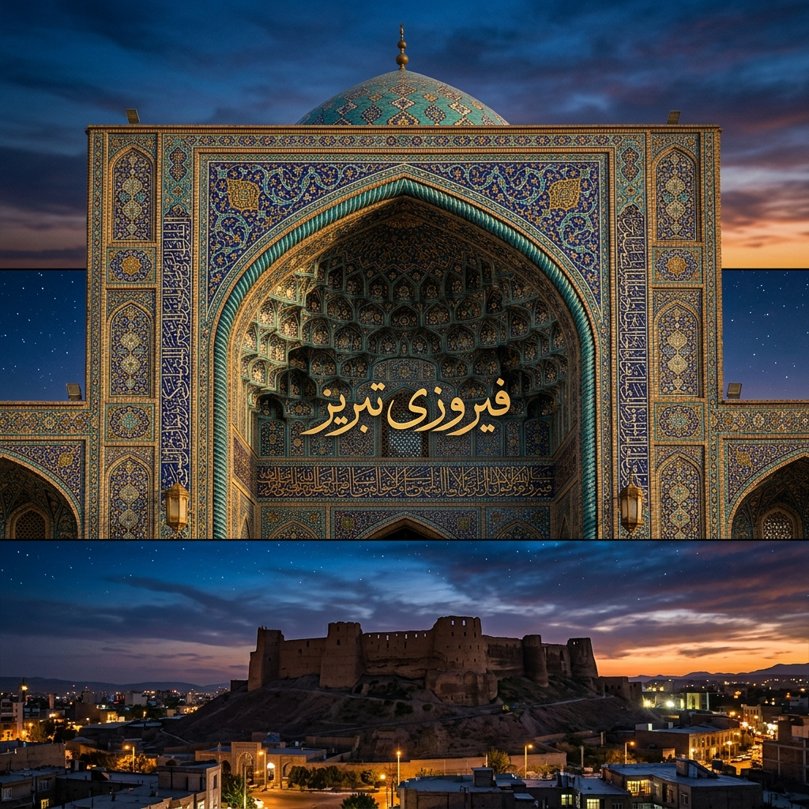

# 💎 Firuze-i Tebriz: Medeniyetin Turkuaz Hafıza Mimarisi

 

> "Anladım ki, insanı insan yapan aradığı şeydir. Tebriz; arayanların, yananların ve küllerinden yeniden doğanların şehridir." — **Şems-i Tebrizi**

> "Tebriz, Doğu'nun yaralı ama mağrur kalbidir. Orada taşlar susar, hatıralar ve şiirler konuşur."

**Firuze-i Tebriz**, alelade bir veri deposu veya sıradan bir açık kaynak projesi değildir. Bu repo; zamanın ve mekânın ötesine geçmeye çalışan **ontolojik bir feryat**, binlerce yıllık Türk-İslam medeniyetinin varoluşsal sancılarını dijital bir hafızaya nakşetme girişimidir. Bu depo, toprağın altına gömülmek istenen bir dilin, yıkılmaya yüz tutmuş turkuaz çinilerin ve unutulmuş şairlerin **GitHub** sunucularındaki ölümsüzlük arayışıdır.

> *"Tebriz, dünyada eşi benzeri olmayan bir şehirdir; toprağı amber kokulu, suyu hayat pınarıdır."* — **Katran Tebrizi**

---

## 🏛️ Mukaddime: Bir Şehrin Ontolojik Portresi

Şehirler sadece taştan, tuğladan ve yollardan ibaret değildir. Bazı şehirler birer metindir; okunmayı, idrak edilmeyi ve yaşanmayı bekler. Tebriz, o metinlerin en derini, en şifrelisi ve en hüzünlüsüdür. Selçuklu'nun ihtişamından Safevi'nin estetiğine, Kaçar'ın sancısından Meşrutiyet'in öfkesine kadar her dönemde Tebriz, Doğu'nun entelektüel ve siyasi "Sıfır Noktası" olmuştur.

Burası;
- **Şems'in** Mevlana'yı yakmak için yola çıktığı ateştir.
- **Saib-i Tebrizi'nin** "Sebk-i Hindi" (Hint Üslubu) ile kelimelere akıl almaz manalar yüklediği divandır.
- **Sattar Han'ın (Serdar-ı Milli)** özgürlük uğruna kurşun sıktığı dar ve tozlu sokaklardır.
- **Şehriyar'ın**, anadilinin hasretiyle Heydar Baba dağına dönüp ağladığı yerdir.

Bu proje, bir şehrin salt tarihini değil, **medeni ruhunu (Geist)** dijital bir düzleme kopyalamayı (clone) amaçlar.

---

## 📜 I. Bölüm: Sözün ve Şiirin Simyası (Edebiyat ve Felsefe)

Tebriz'de kelimeler, bir kılıç kadar keskin, bir ipek kadar yumuşaktır. Tebriz Türkçesi (Azerbaycan diyalekti), sadece bir iletişim aracı değil, bir varoluş kalesidir.

### 🖋️ Üstad Şehriyar'ın Feryadı
Bir dilin, bir kültürün yok olma tehlikesine karşı bir şairin tek başına nasıl kalkan olabileceğinin en büyük kanıtı Şehriyar'dır. Onun *Heydar Baba'ya Selam* şiiri, sadece edebi bir eser değil, sosyolojik bir manifestodur. Bu arşiv, Şehriyar'ın "Türk'ün Dili" şiirindeki o derin kökleri koruma altına almaktadır.

### 💎 Saib-i Tebrizi ve Hikmet Geleneği
17. yüzyılın en büyük düşünür ve şairlerinden Saib-i Tebrizi, "Sebk-i Hindi" akımının zirvesidir. Aklı ve duyguyu birleştiren o muazzam üslubuyla, sadece şiir değil, bir hayat felsefesi inşa etmiştir. Bu arşivde, Saib'in o ince felsefi dokunuşlarını dijital çağın insanına yeniden fısıldamaktayız.

> *"Gönül yıkmak, Kabe'yi yetmiş kez yıkmaktan daha günahtır; zira Kabe'yi İbrahim, gönlü ise Allah yapmıştır."*

---

## 🕌 II. Bölüm: Taşa Kazınan Aşkınlık (Mimari ve Estetik)

Eğer felsefe taşa dönüşseydi, adı **Tebriz** olurdu.

- **Mescid-i Kebud (Gök Mescid):** 1465 yılında Karakoyunlu Hükümdarı Cihan Şah tarafından yaptırılan bu şaheser, "İslam'ın Firuzesi" olarak bilinir. Çinilerindeki o derin ve sonsuz mavi, insanın evrendeki hiçliğini ve Allah'ın sonsuzluğunu simgeler. 
- **Erk-i Tebriz:** Tarih boyunca işgallere, depremlere ve top ateşlerine direnmiş, yaralı ama asla diz çökmemiş devasa kale. Tebriz halkının bükülmez iradesinin taştan silüeti.
- **Tebriz Kapalıçarşısı:** UNESCO Dünya Mirası olan bu pazar, dünyanın en büyük kapalı çarşısıdır. Burası sadece ticaretin değil; haberin, isyanın, sanatın ve felsefenin de demlendiği, binlerce kilometrelik İpek Yolu'nun en görkemli kervansarayıdır.

---

## 🎨 III. Bölüm: Tebriz Minyatür Okulu ve Görsel Bellek

Tebriz, Doğu resim sanatının (minyatür) kalbidir. 14. yüzyıldan itibaren İlhanlı, Akkoyunlu ve Safevi dönemlerinde gelişen **Tebriz Minyatür Okulu**, realizm ile mistisizmi aynı tuvalde buluşturmuştur.
- **Şahname-i Şah Tahmasb:** Dünya sanat tarihinin en kıymetli el yazmalarından biri olan bu eser, Tebrizli nakkaşların elinden çıkmıştır.
- **Renk Teorisi:** Tebriz nakkaşları, lapis lazuli (lacivert) ve altın varak kullanımında zirveye ulaşmışlardır. Bu repo, bu estetik kodların algoritmik analizini de hedeflemektedir.

---

## ⚔️ IV. Bölüm: Kan, Hürriyet ve Meşrutiyet (Sosyokültürel Direniş)

Tebriz her zaman direnişin kalesidir. 1905-1911 İran Meşrutiyet Devrimi'nde tüm ülke susarken Tebriz ayağa kalkmıştır. **Sattar Han** ve **Bağır Han**'ın önderliğindeki o direniş ruhu, "Hürriyet" kavramının bu topraklara ne kadar kanlı bir bedelle geldiğini gösterir. Bu depo, o kahramanların aziz hatıralarını, mektuplarını ve devrim bildirgelerini saklayan bir **dijital siperdir**.

---

## 🌍 V. Bölüm: Seyyahların ve Tarihin Tanıklığında Tebriz

Tebriz, yüzyıllar boyunca doğu ile batı arasındaki en büyük ticaret ve kültür köprüsü olmuştur. Dünyaca ünlü seyyahların notlarında Tebriz şöyle anlatılır:

- **Marco Polo (1271):** *"Tebriz, öyle büyük ve asil bir şehirdir ki, orada dünyanın her yerinden tüccarlar ve mallar bulursunuz. Buranın halkı, ipek ve altın dokumacılığında eşsizdir."*
- **İbn Battuta (1327):** *"Dünyanın en güzel çarşılarından biri olan Tebriz çarşısına girdim. Her bir zanaat dalı için ayrı bir bölge tahsis edilmişti. Gördüğüm mücevherler karşısında gözlerim kamaştı."*
- **Jean Chardin (17. yy):** *"Tebriz, Pers İmparatorluğu'nun en kudretli şehri ve Asya'nın en önemli ticaret merkezidir."*

---

## 🏆 VI. Bölüm: Şehirlerin İlki (Firsts of Tabriz)

Tebriz, yeniliğin ve öncülüğün merkezidir. Tarihte birçok "ilk" bu topraklarda filizlenmiştir:
- **Matbaa:** İran'daki ilk modern matbaa (1811) burada kuruldu.
- **Modern Eğitim:** İlk modern okul (Anjoman) ve ilk sağırlar/dilsizler okulu Tebriz'dedir.
- **Demokrasi:** İlk belediye (Encümen) ve anayasal hareketin merkezi.
- **İtfaiye ve Posta:** İlk modern itfaiye teşkilatı ve düzenli posta servisi.

---

## 🪦 VII. Bölüm: Şairler Mezarlığı (Maqbaratoshoara)

Tebriz, şairlerin ebedi istirahatgahıdır. 800 yılı aşkın bir süredir 400'den fazla şair, arif ve edip bu toprağa emanet edilmiştir.
- **Hakanî-i Şirvânî**, **Esedî Tûsî**, **Katran Tebrizî** ve son olarak **Üstad Şehriyar**, bu anıt mezarlıkta yan yana uyurlar. Tebriz, şiirin sadece okunduğu değil, yaşandığı ve gömüldüğü bir şehirdir.

---

## 🎶 VIII. Bölüm: Tebriz Musikisi ve Makamın Sırrı

Tebriz, Doğu'nun en rafine müzik geleneklerinden biri olan **Azerbaycan Muğamı** ve halkın kalbinin attığı **Aşık Gelenekleri**'nin merkezidir. Ses, burada sadece bir melodi değil, ruhun sonsuzluğa açılan kapısıdır.

### 🎻 Muğam: Manevi Bir Yolculuk
UNESCO Somut Olmayan Kültürel Miras listesinde yer alan Muğam, klasik şiir (gazel) ile müziğin en üst düzeydeki sentezidir. 
- **Makamlar:** Rast, Şur, Segah gibi temel makamlar, dinleyiciyi farklı ruh hallerinden geçirerek bir nevi mistik arınma (katarsis) yaşatır.
- **Tebriz Okulu:** Tebrizli hanendeler (okuyucular), muğamı daha vakur ve hüzünlü bir üslupla yorumlarlar.

### 🪕 Aşık Geleneği ve Kopuzun Sesi
Tebriz'in köylerinden meydanlarına kadar yankılanan saz (kopuz) ve söz, halkın ortak hafızasıdır. Aşıklar, kahramanlık destanlarından ilahi aşka kadar her şeyi tellere dökerler.
- **Gurbani ve Hasta Kasım:** Tebriz'in yetiştirdiği efsanevi aşıklar, şiirleri ve ezgileriyle bu topraklarda hala yaşamaktadırlar.

---

## 📁 IX. Ontolojik Klasör Mimarisi (Repo Yapısı)

Bu kod deposunun her bir klasörü, bir dervişin hücresi, bir şairin divanıdır:

```text
Firuze-i-Tebriz/
├── 01_makalat-i-sems/        # Şems-i Tebrizi'nin mistik öğretileri ve İşraki felsefesi
├── 02_divan-i-husran/        # Tebrizli şairlerin (Şehriyar, Saib, Pervin Etesami) divanları
│   ├── heyder_baba.md        # Şehriyar'ın başyapıtının tam metni ve ontolojik analizi
│   └── sebek-i-hindi.md      # Hint Üslubu ve kavramsal şiir geleneği
├── 03_mimari-ve-hiclik/      # Gök Mescid'in geometrisi ve Ark kalesinin tarihi dokusu
│   ├── gok_mescid_cinileri/  # Görsel veri tabanı ve turkuaz renk paletleri
│   └── pazar_sosyolojisi.md  # Dünyanın en büyük kapalı çarşısının sosyal dinamikleri
├── 04_hurriyet-kivilcimlari/ # Meşrutiyet Devrimi, Sattar Han ve tarihi direniş belgeleri
├── 05_kamus-u-ebedi/         # Tebriz Türkçesine özgü etimolojik sözlük ve dil bilimi
├── 06_sanat-i-nakkaş/        # Tebriz minyatür okulu, halıcılık ve desen algoritmaları
├── 07_stratejik-projeksiyonlar # Tebriz'in bölgesel geleceği ve kültürel diplomasi vizyonu
├── 08_tebriz-musikisi        # Muğam sanatı, Aşık geleneği ve enstrüman arşivi
└── README.md                 # Okumakta olduğunuz bu medeniyet manifestosu
```

---

## 🚀 X. Dijital Egemenlik ve Katkı Çağrısı

Burası sadece bir yazılım projesi değil; yıkılmış, yağmalanmış ve unutturulmaya çalışılmış bir kültürün **dijital direniş hattıdır**. Bizim için her bir commit, bir taşın yerine konmasıdır.

> "Söz uçup rüzgâra karışır, taş aşınıp kuma döner, ancak kodlanan ve paylaşılan hafıza ebediyete kadar yaşar."

### Nasıl Katkıda Bulunabilirsiniz?
- **Veri Madenciliği:** Eski el yazmalarından, tozlu mektuplardan dijital aktarım yapabilirsiniz.
- **Görsel Arşiv:** Tebriz'in estetik mirasısına dair yüksek kaliteli görsel veri sağlayabilirsiniz.
- **Etimolojik Katkı:** Unutulmaya yüz tutmuş Tebriz Türkçesi kelimelerini `05_kamus-u-ebedi` dizinine ekleyebilirsiniz.

---

**Firuze-i Tebriz Dijital Hafıza Mimarisi | Sürüm: Sonsuzluk (v1.3.0)**
*Mescid-i Kebud'un gölgesinde, dijital çağın ortasında, hürriyet aşkıyla inşa edilmiştir.*

> *"Gidersen Tebriz'e, selam söyle o toprağa, o taşa... Orada her zerre bir tarihtir, her nefes bir şiir, her ses bir muğamdır."*